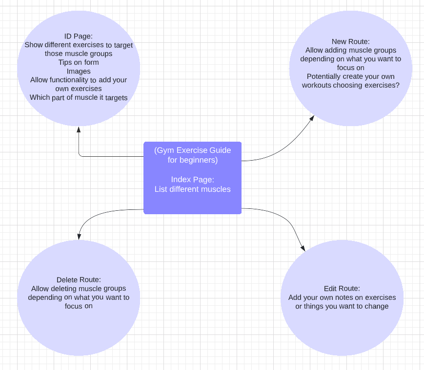
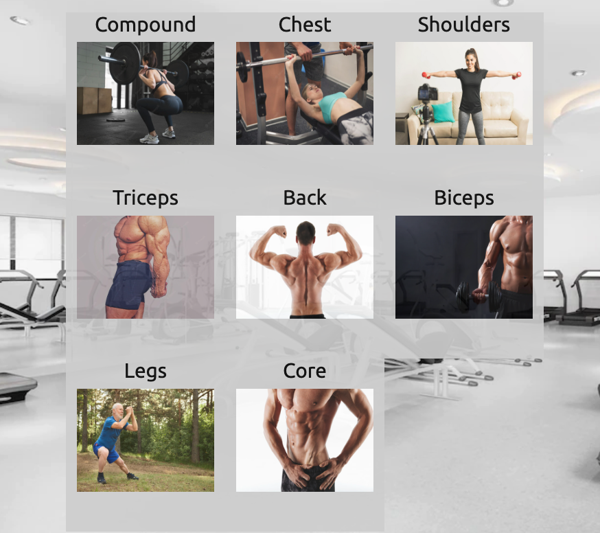

# Gym App

Welcome to my creation of a Gym App using the principles of CRUD and RESTful routes. Feel free to tailor the website to your fitness requirements.

The website can be accessed here: https://gym-guru.herokuapp.com/

--- 

### Languages Used:

- HTML5
- CSS3
- Express.js
- MongoDB
- Mongoose
- EJS
- Node.js

---

### Overview

This is my first web app completed for the Software Engineering Immersive bootcamp with General Assembly. I found this a challenging but enjoyable experience especially seeing all the elements come together to something I'm pretty proud of. I combined my interest in fitness and functionality to create an experience that could benefit everyone. I know when I first started my fitness journey I felt a bit lost in the gym; being unsure of what to do. So I wanted to create a website that would remove the intimidation and allow you to keep track of exercises you enjoy so you can revist these as you go to the gym.

---

### Creative Process

I initially based the idea of the website to tailor it towards a beginner's guide to the gym but felt I could expand this to reach a larger audience and something I could even use myself. Deciding which core muscles to base categories around was based on the Push Pull Legs Split because this is what I'm most experienced with and would be able to target a range of muscle groups that anybody could have an interest in. 

Initial Wireframe: 

Developed into the current website: 

--- 

### Functionality

The website contains CRUD functionality as well as a login/ logout system. I have configured the website so that you are able to view the index, display and individual exercise pages without needing an account however trying to add an exercise or delete an exercise will require the use of an account. I made this decision because I know how annoying creating an account is. Although the account creation process for this website is quite simple, I still want to make it as appealing and easy to use as possible without getting frustrated by simple functionality.

---

### Challenges

For me the greatest challenge was figuring out how to centre my website around the categories. Typically when doing labs and exercises within the course, the homepage contained direct routes to adding and deleting items however I added an extra layer which made the logic more complicated. I was overwhelmed with the logic at the start but with some guidance was able to understand and work through this initial setback.

--- 

### Future Changes

In the future I would like to add functionality to increase the number of inputs to exercise form guidelines so that rather than having one sentence of form displaying, multiple would so that would give a better understanding of how to properly do an exercise.

Adding an ability to choose exercises that would go into a 'my workouts' section would also be something I would like to add.

---

### References

The Favicon for this website was used from the website below.

Favicon Reference:
https://www.flaticon.com/free-icon/arm_102833

All pictures used as the background, category images and seeded images were taken from [Free Pik](www.freepik.com)

